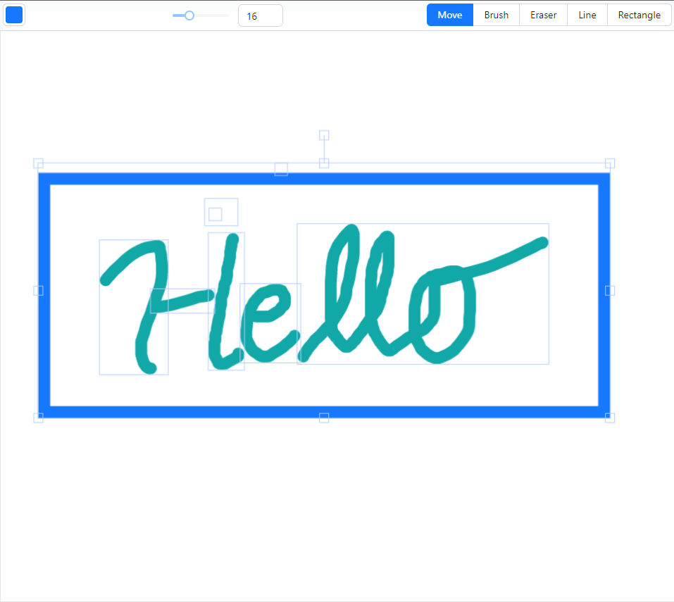

# Strata | Whiteboard app

Real-time, collaborative whiteboard made with Fabric.JS, Next.JS, and Socket.IO

## Features

- Drawing free hand brushes, lines, rectangles
- Eraser
- Color selection and recent history
- Moving, scaling, flipping selected objects
- Saving canvas

## Made using

- Next.JS
- Fabric.JS
- TailwindCSS
- Express
- Socket.IO
- Firebase

## Installation

Clone repository, install all npm packages and run "start-dev-server" and "dev".

## Screenshots

#### Canvas

